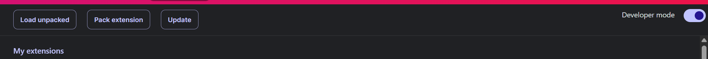
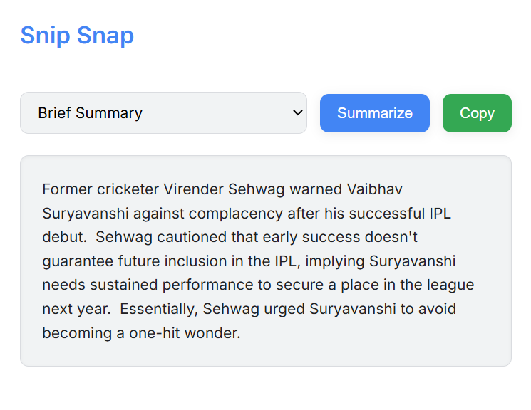

# Web Page Summarizer Extension

## 📋 Installation

1. **Enable developer mode** in Chrome
2. **Click on "Load unpacked extension"**
3. **Select** the folder where the extension is present

## 🚀 Features

The extension provides three summary modes:

1. **Brief summary** - Quick overview of the content
2. **Detailed summary** - Comprehensive content analysis
3. **Bullet point summary** - Key points in an easy-to-scan format

## 📷 Preview

